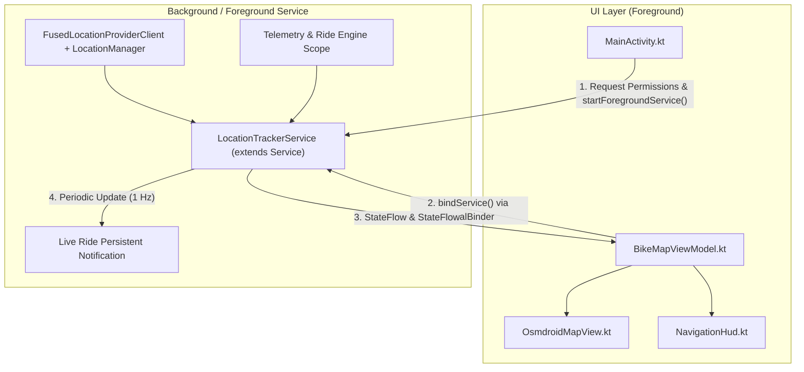

# 📋 Implementation Plan: Android Foreground Service for Background GPS Tracking & Navigation

## 1. Executive Summary & Root Cause Analysis

### 1.1 Problem Statement
In the current implementation, `com.ebike.router.service.LocationTrackerService` is implemented as a standard Kotlin class instantiated directly by `BikeMapViewModel` via `LocationTrackerService(application)`. Furthermore, `AndroidManifest.xml` lacks `<service>` declarations and critical foreground/background permissions.

### 1.2 Root Cause of GPS Loss on Android 12+ (and 14+)
1. **Background Execution & Location Throttling (Android 8.0+ / 12+)**:
   - When the user turns off the screen or switches away from the app, Android places the app into the `cached` or `background` process state.
   - In this state, the OS enforces aggressive background location throttling: `FusedLocationProviderClient` throttles location deliveries to only a few updates per hour (or ceases completely), and `LocationManager` updates are paused.
   - Android Doze Mode suspends network access and wakelocks, terminating active coroutines and location listeners.
2. **Missing Android Foreground Service**:
   - Without an active Android `Service` promoted to the foreground (`startForeground()`), the OS has no signal that continuous location tracking is actively servicing the user.
3. **Android 14+ (API 34 / Target SDK 35) Restrictions**:
   - The app targets SDK 35 (`compileSdk = 35`, `targetSdk = 35`). On Android 14+, running a foreground service for location requires:
     - `android.permission.FOREGROUND_SERVICE`
     - `android.permission.FOREGROUND_SERVICE_LOCATION`
     - Manifest declaration with `android:foregroundServiceType="location"`
     - Explicit runtime location permissions (`ACCESS_FINE_LOCATION` or `ACCESS_COARSE_LOCATION`) held *before* calling `startForeground()`.
   - On Android 13+ (API 33), displaying the persistent foreground service notification requires runtime `android.permission.POST_NOTIFICATIONS`.

---

## 2. Architecture & Design: Hybrid Started & Bound Service

To provide seamless background tracking while allowing Jetpack Compose and `BikeMapViewModel` to reactively render map markers, cockpit telemetry, and navigation HUDs, we adopt the **Hybrid (Started + Bound) Service Architecture**.



### 2.1 Why the Hybrid Pattern?
- **Started Service (`startForegroundService` / `startService`)**:
  - Keeps the service alive and continuously tracking in the foreground even when `MainActivity` is backgrounded, the screen is locked, or the Activity is destroyed due to low memory.
- **Bound Service (`bindService` with `LocalBinder`)**:
  - Provides a direct, type-safe IPC channel within the same process.
  - Allows `BikeMapViewModel` to observe `StateFlow`s (`locationState`, `telemetry`, `isNavigating`), trigger navigation commands (`startNavigation`, `stopNavigation`), and handle map recentering without complex broadcast receivers.

---

## 3. Manifest & Permissions Specification

### 3.1 Permissions to Add in `AndroidManifest.xml`
```xml
<!-- Existing Permissions -->
<uses-permission android:name="android.permission.INTERNET" />
<uses-permission android:name="android.permission.ACCESS_COARSE_LOCATION" />
<uses-permission android:name="android.permission.ACCESS_FINE_LOCATION" />
<uses-feature android:name="android.hardware.location.gps" />
<uses-permission android:name="android.permission.VIBRATE" />
<uses-permission android:name="android.permission.WAKE_LOCK" />

<!-- NEW: Foreground Service Permissions (API 28+ & API 34+) -->
<uses-permission android:name="android.permission.FOREGROUND_SERVICE" />
<uses-permission android:name="android.permission.FOREGROUND_SERVICE_LOCATION" />

<!-- NEW: Notification Permission for Android 13+ (API 33+) -->
<uses-permission android:name="android.permission.POST_NOTIFICATIONS" />

<!-- NEW: Background Location (Optional/Complementary) -->
<uses-permission android:name="android.permission.ACCESS_BACKGROUND_LOCATION" />
```

> [!NOTE]
> **Foreground Service vs. Background Location**: In Android 10+, an active foreground service with `foregroundServiceType="location"` is legally classified by Android as a **foreground location access** ("while-in-use"). This means continuous GPS tracking continues with the screen off as long as `ACCESS_FINE_LOCATION` is granted. Declaring `ACCESS_BACKGROUND_LOCATION` in the manifest provides compatibility if background geofencing or passive tracking is ever requested, but is not strictly needed for the foreground service itself, avoiding strict Play Store review friction unless necessary.

### 3.2 Service Declaration in `<application>`
```xml
<service
    android:name=".service.LocationTrackerService"
    android:enabled="true"
    android:exported="false"
    android:foregroundServiceType="location" />
```
- `android:exported="false"` prevents external applications from accessing or hijacking the service.
- `android:foregroundServiceType="location"` satisfies Android 14+ strict service type matching.

---

## 4. Detailed Component Design

### 4.1 Refactoring `LocationTrackerService.kt` (Android `Service`)

`LocationTrackerService` will inherit from `android.app.Service`.

#### A. Internal Binder & Actions
```kotlin
class LocationTrackerService : Service() {
    inner class LocalBinder : Binder() {
        fun getService(): LocationTrackerService = this@LocationTrackerService
    }
    private val binder = LocalBinder()

    companion object {
        const val ACTION_START_TRACKING = "com.ebike.router.action.START_TRACKING"
        const val ACTION_STOP_TRACKING = "com.ebike.router.action.STOP_TRACKING"
        const val ACTION_PAUSE_RIDE = "com.ebike.router.action.PAUSE_RIDE"
        const val ACTION_RESUME_RIDE = "com.ebike.router.action.RESUME_RIDE"
        const val NOTIFICATION_ID = 1001
        const val CHANNEL_ID = "ebike_ride_tracking_channel"
    }

    override fun onBind(intent: Intent?): IBinder = binder
    ...
}
```

#### B. Notification Channel & Live Stats Notification
- **Channel**:
  - ID: `ebike_ride_tracking_channel`
  - Name: `"Rastreamento e Navegação do Pedal"`
  - Importance: `NotificationManager.IMPORTANCE_LOW` (vital so updating live stats does not produce repeated notification chimes/vibrations).
- **Persistent Notification Builder**:
  - `setOngoing(true)` (prevents user swipe-to-dismiss while riding).
  - `setOnlyAlertOnce(true)` (silent in-place updates).
  - `setCategory(NotificationCompat.CATEGORY_NAVIGATION)` / `CATEGORY_WORKOUT`.
  - `setSmallIcon(R.mipmap.ic_launcher)` (or dedicated bike icon).
  - `setContentIntent(pendingIntent)` pointing to `MainActivity` with `FLAG_ACTIVITY_SINGLE_TOP`.
  - **Live Content Fields**:
    - **Title**: `"EBike Router • Pedal em Andamento"` or `"Navegando para Destino"`
    - **Text / BigText**:
      - `Velocidade: 24.5 km/h • Distância: 12.3 km • Tempo: 32:15`
      - `Bateria: 85% • Modo: TOUR • Potência: 180W`
      - If navigating: Next maneuver: `Em 120m: Vire à direita na Av. Paulista`
  - **Action Buttons**:
    - "Pausar / Retomar"
    - "Encerrar Pedal"
  - **Throttling**:
    - Limit notification redraws to 1 update per second (`1000ms`) via a coroutine ticker or debounced Flow collector to prevent Android system notification rate limiting (`NotificationManagerService` dropped notifications).

#### C. Lifecycle & Foreground Start (`onStartCommand`)
```kotlin
override fun onStartCommand(intent: Intent?, flags: Int, startId: Int): Int {
    when (intent?.action) {
        ACTION_START_TRACKING -> {
            startForegroundServiceNotification()
            startTracking()
        }
        ACTION_STOP_TRACKING -> {
            stopTracking()
            stopForeground(STOP_FOREGROUND_REMOVE)
            stopSelf()
        }
        ACTION_PAUSE_RIDE -> pauseRide()
        ACTION_RESUME_RIDE -> resumeRide()
    }
    return START_STICKY
}

private fun startForegroundServiceNotification() {
    createNotificationChannel()
    val notification = buildLiveRideNotification()
    if (Build.VERSION.SDK_INT >= Build.VERSION_CODES.Q) {
        ServiceCompat.startForeground(
            this,
            NOTIFICATION_ID,
            notification,
            ServiceInfo.FOREGROUND_SERVICE_TYPE_LOCATION
        )
    } else {
        startForeground(NOTIFICATION_ID, notification)
    }
}
```

#### D. Moving the Navigation/Ride Loop into the Service
Currently, `BikeMapViewModel` runs `startRideTimer()` in `viewModelScope`.
To ensure stats, distance tracking, TTS audio announcements, and notification updates continue smoothly when the phone screen is turned off:
1. Move the `startRideTimer()` and telemetry calculation loop into `LocationTrackerService` (within a dedicated `serviceScope = CoroutineScope(Dispatchers.Main + SupervisorJob())`).
2. Expose `val telemetry: StateFlow<LiveRideTelemetry>` and `val locationState: StateFlow<RiderLocationState>` from the Service.
3. In `onDestroy()`, clean up `serviceScope.cancel()`, release any partial wake locks, remove location updates from `fusedLocationClient` and `locationManager`.

---

### 4.2 Updating `MainActivity.kt`

#### A. Permission Request Flow
Update permissions checked and requested:
```kotlin
private val requestPermissionLauncher = registerForActivityResult(
    ActivityResultContracts.RequestMultiplePermissions()
) { permissions ->
    val fineGranted = permissions[Manifest.permission.ACCESS_FINE_LOCATION] == true
    val coarseGranted = permissions[Manifest.permission.ACCESS_COARSE_LOCATION] == true
    
    if (fineGranted || coarseGranted) {
        startAndBindTrackerService()
    }
}

private fun checkAndRequestPermissions() {
    val permissionsToRequest = mutableListOf(
        Manifest.permission.ACCESS_FINE_LOCATION,
        Manifest.permission.ACCESS_COARSE_LOCATION
    )
    if (Build.VERSION.SDK_INT >= Build.VERSION_CODES.TIRAMISU) {
        permissionsToRequest.add(Manifest.permission.POST_NOTIFICATIONS)
    }
    // Check if permissions need to be launched
    val missing = permissionsToRequest.filter {
        ContextCompat.checkSelfPermission(this, it) != PackageManager.PERMISSION_GRANTED
    }
    if (missing.isNotEmpty()) {
        requestPermissionLauncher.launch(missing.toTypedArray())
    } else {
        startAndBindTrackerService()
    }
}
```

#### B. Service Start & Connection Binding
```kotlin
private fun startAndBindTrackerService() {
    val serviceIntent = Intent(this, LocationTrackerService::class.java).apply {
        action = LocationTrackerService.ACTION_START_TRACKING
    }
    ContextCompat.startForegroundService(this, serviceIntent)
    viewModel.bindService(this)
}
```

---

### 4.3 Updating `BikeMapViewModel.kt`

#### A. Replacing Direct Instantiation with Bound Connection
- Remove `val locationTracker = LocationTrackerService(application)`.
- Introduce a reactive connection state:
```kotlin
private var serviceConnection: ServiceConnection? = null
private val _trackerService = MutableStateFlow<LocationTrackerService?>(null)
val trackerService: StateFlow<LocationTrackerService?> = _trackerService.asStateFlow()

// Forwarded StateFlows for UI composables
val locationState = MutableStateFlow(RiderLocationState())
```

#### B. `bindService` Implementation
```kotlin
fun bindService(context: Context) {
    if (serviceConnection != null) return

    val connection = object : ServiceConnection {
        override fun onServiceConnected(name: ComponentName?, service: IBinder?) {
            val binder = service as? LocationTrackerService.LocalBinder
            val svc = binder?.getService()
            _trackerService.value = svc
            
            // Collect service flows into ViewModel flows
            svc?.let { s ->
                viewModelScope.launch {
                    s.locationState.collect { loc ->
                        locationState.value = loc
                        handleRiderLocationUpdate(loc.point, loc.speedKmh, loc.headingDegrees)
                    }
                }
                viewModelScope.launch {
                    s.telemetry.collect { telem ->
                        _telemetry.value = telem
                    }
                }
            }
        }

        override fun onServiceDisconnected(name: ComponentName?) {
            _trackerService.value = null
        }
    }

    val intent = Intent(context, LocationTrackerService::class.java)
    context.bindService(intent, connection, Context.BIND_AUTO_CREATE)
    serviceConnection = connection
}
```

#### C. Backward Compatibility with Compose Components
In `OsmdroidMapView.kt`, line 36 reads:
`val locationState by viewModel.locationTracker.locationState.collectAsState()`
- Keep a convenience accessor: `val locationTracker: StateFlow<RiderLocationState> get() = locationState` or expose `viewModel.locationState` directly.
- Delegate UI commands (`recenterMap()`, `startNavigation()`, `startSimulation()`, `stopNavigation()`) directly to `_trackerService.value`.
- Cleanly unbind in `onCleared()`:
```kotlin
override fun onCleared() {
    super.onCleared()
    serviceConnection?.let { conn ->
        getApplication<Application>().unbindService(conn)
        serviceConnection = null
    }
    audioGuidance.shutdown()
}
```

---

## 5. Step-by-Step Implementation Roadmap

### Phase 1: Manifest & Permissions Setup
1. Edit `app/src/main/AndroidManifest.xml`:
   - Add `FOREGROUND_SERVICE` and `FOREGROUND_SERVICE_LOCATION`.
   - Add `POST_NOTIFICATIONS` (Android 13+).
   - Add `ACCESS_BACKGROUND_LOCATION`.
   - Declare `<service android:name=".service.LocationTrackerService" android:foregroundServiceType="location" android:exported="false" />`.

### Phase 2: Refactor `LocationTrackerService.kt` to an Android Service
1. Change class declaration to `class LocationTrackerService : Service()`.
2. Implement `LocalBinder` and `onBind()`.
3. Implement `createNotificationChannel()` and `buildLiveRideNotification()`.
4. Implement `onStartCommand()` handling `ACTION_START_TRACKING`, `ACTION_STOP_TRACKING`, and foreground promotion via `ServiceCompat.startForeground`.
5. Integrate persistent notification updates (throttled to 1 Hz with live speed, distance, battery, and next turn maneuver).
6. Implement `onDestroy()` with clean resource teardown (remove Fused Location updates, cancel coroutines, remove notification).

### Phase 3: Enhance `MainActivity.kt`
1. Update `checkLocationPermissions()` to check and request `ACCESS_FINE_LOCATION`, `ACCESS_COARSE_LOCATION`, and `POST_NOTIFICATIONS` (API 33+).
2. Start the foreground service via `ContextCompat.startForegroundService()` upon granting permissions.
3. Call `viewModel.bindService(this)` to bind UI to the Service.

### Phase 4: Refactor `BikeMapViewModel.kt` & Connect Compose UI
1. Remove direct instantiation of `LocationTrackerService(application)`.
2. Implement `bindService()` and `unbindService()` using `ServiceConnection`.
3. Re-route location and telemetry flows so that `OsmdroidMapView` and `NavigationHud` seamlessly observe state from the bound service.
4. Delegate actions like `recenterMap()`, `startNavigation()`, `startSimulation()` to the service.

### Phase 5: Verification & Edge Case Handling
1. Test app backgrounding and screen locking on Android 12, 13, and 14+ emulators/devices.
2. Verify GPS location updates continue arriving and map polyline / rider position updates in real-time.
3. Verify persistent notification displays live speed, distance, battery %, and upcoming maneuvers.
4. Verify tapping the notification seamlessly reopens `MainActivity` via `SingleTop`.
5. Verify clean shutdown when user stops navigation or tracking.
