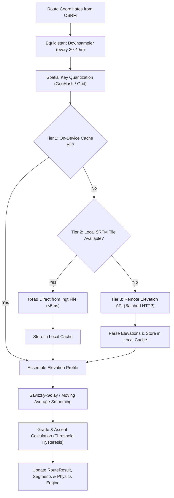
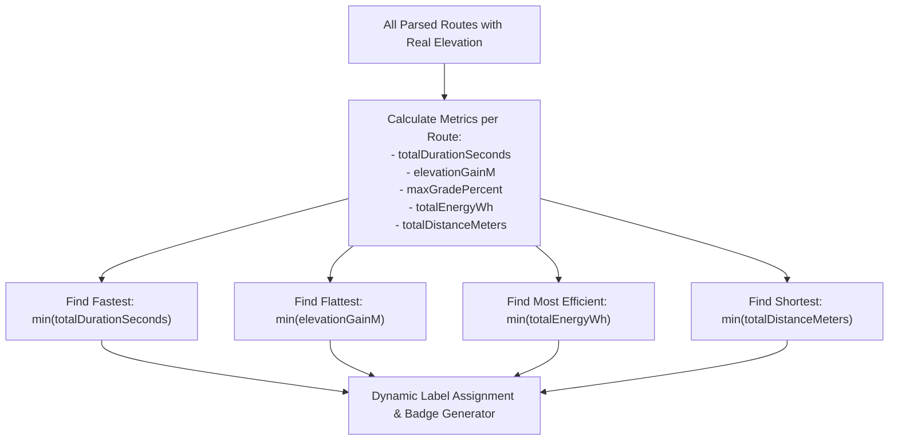

# Implementation Plan: Real Elevation & Grade Engine for E-Bike / Normal Bike Router

## 1. Executive Summary & Problem Diagnosis

### 1.1 Current Implementation Analysis
In the current codebase ([`GraphRouterService.kt`](app/src/main/kotlin/com/ebike/router/service/GraphRouterService.kt)), elevation and road gradients are entirely synthetic:
- **Hardcoded Base Elevation**: All route points default to an arbitrary 20.0 meters (`GeoPoint(lat, lng, 20.0)` in line 104 and line 146).
- **Synthetic Sinusoidal Grade**: In line 150 of `GraphRouterService.kt`:
  ```kotlin
  val stepGrade = ((sin(stepIdx * 1.4 + routeIndex) * (if (profile == RoutingProfile.TURBO) 4.5 else 2.8) * slopeMultiplier) * 10).roundToInt() / 10.0
  val stepEleDiff = ((stepDist * stepGrade) / 100.0).roundToInt()
  ```
- **Artificial Route Differentiation**: Line 127 injects an artificial `slopeMultiplier`:
  ```kotlin
  val slopeMultiplier = if (routeIndex == 0) 1.0 else if (routeIndex == 1) 0.6 else 1.3
  ```
  Route index 1 is artificially multiplied by `0.6` to simulate less elevation, while route index 2 is multiplied by `1.3`.
- **Misleading Route Alternative Claims**: Lines 221–230 statically label route alternatives based on their array index:
  ```kotlin
  val routeTitles = listOf(
      "Rota Mais Rápida$viaText",
      "Caminho Mais Plano (Eco)$viaText",
      "Ciclovia Cênica$viaText"
  )
  ```
  Route 1 is unconditionally declared *"Caminho Mais Plano (Eco)"* even though OSRM returns routes prioritized by travel weight/time, meaning alternative 1 could easily have significantly more climbing than alternative 0 in real topography.

### 1.2 Downstream Ripple Effects in the App
The fake elevation data corrupts multiple critical subsystems:
1. **Physical Energy & Battery Modeling ([`EBikePhysicsEngine.kt`](app/src/main/kotlin/com/ebike/router/physics/EBikePhysicsEngine.kt))**:
   - Computes gravitational resistance: $F_{\text{gravity}} = m \cdot g \cdot \sin(\theta)$ where $\theta = \arctan(\text{gradePercent} / 100.0)$.
   - Mechanical power, electrical motor demand (Watts), rider leg effort (Watts), and battery depletion (Wh) are distorted by periodic sine oscillations rather than actual road topography.
   - Regenerative braking is falsely triggered when the sine wave happens to dip below `-3.0%`.
2. **Elevation Profile Chart ([`ElevationProfileChart.kt`](app/src/main/kotlin/com/ebike/router/ui/components/ElevationProfileChart.kt))**:
   - Displays a synthetic undulating curve and inaccurate summary badges (`▲ elevationGainM`, `▼ elevationLossM`, `Máx: maxGradePercent%`).
   - For regular cyclists ("normal-bike-first") and e-bike riders planning battery usage, an inaccurate elevation profile destroys trust.
3. **Map Polyline Grade Coloring ([`OsmdroidMapView.kt`](app/src/main/kotlin/com/ebike/router/ui/components/OsmdroidMapView.kt))**:
   - Segments are rendered in Cyan (`< 0%`), Emerald (`0–3%`), Amber (`3–7%`), and Red (`> 7%`) purely based on sine values, misleading the rider about upcoming steep hills.
4. **Turn-by-Turn & Audio Guidance ([`AudioGuidanceService.kt`](app/src/main/kotlin/com/ebike/router/service/AudioGuidanceService.kt), [`NavigationHud.kt`](app/src/main/kotlin/com/ebike/router/ui/components/NavigationHud.kt))**:
   - `mapManeuver` injects `ManeuverType.CLIMB_AHEAD` when `stepGrade >= 6.0`, prompting the voice guide to announce *"Subida íngreme à frente! Aumente o nível de assistência"* at flat intersections or false locations.

---

## 2. Evaluation of Real Elevation Data Sources

| Criteria | OSRM Public Annotations | Open-Elevation Public API (`api.open-elevation.com`) | Self-Hosted Open-Elevation / OpenTopoData | Bundled SRTM / HGT Tiles (On-Device DEM) | High-Reliability Public API (Open-Meteo DEM) |
| :--- | :--- | :--- | :--- | :--- | :--- |
| **Availability** | ❌ None on public servers | ⚠️ Available but unstable | ✅ High (self-controlled) | ✅ 100% Offline | ✅ 99.9% Uptime |
| **Observed Latency** | N/A (no elevation returned) | ❌ 15,000 – 25,000 ms (measured) | ✅ 20 – 60 ms | ⚡ < 5 ms (in-memory/disk) | ⚡ 100 – 250 ms |
| **Payload Limits** | N/A | Variable (~100 pts POST) | Up to 1,000 pts POST | Unlimited (local seek) | Up to 500 pts GET/POST |
| **Offline Support** | ❌ No | ❌ No | ❌ No | ✅ Complete (no network) | ❌ No |
| **Storage / App Size Cost**| 0 MB | 0 MB | 0 MB | ⚠️ ~2.9 MB per 1°x1° tile (SRTM3) or ~26 MB (SRTM1) | 0 MB |
| **Operational Overhead** | None | None | ⚠️ VPS maintenance ($5/mo) | File packaging & tile indexing | Free tier (up to 10k calls/day) |

### Detailed Assessment by Source

#### 1. OSRM Annotations
- **Findings from Live Query Inspection**:
  Calling `https://routing.openstreetmap.de/routed-bike/route/v1/driving/...?...annotations=true` returns:
  `annotations: ["datasources", "distance", "duration", "metadata", "nodes", "speed", "weight"]`.
- **Verdict**: The public OSRM bike instances **do not index raster elevation**. They cannot provide elevation or gradient data without rebuilding custom OSRM graphs using custom Lua extraction profiles and raster elevation files. This is not viable while using public OSM endpoints.

#### 2. Open-Elevation Public API (`api.open-elevation.com`)
- **Findings from Live Request Inspection**:
  Calling `POST https://api.open-elevation.com/api/v1/lookup` with `{"locations": [{"latitude": -23.5505, "longitude": -46.6333}]}` returned elevation `766.0m`, but took **~20 seconds** for a single point.
- **Verdict**: The public server is severely resource-constrained, subject to community throttling, and exhibits frequent downtime. Relying on it directly in the mobile app would cause route calculation to hang for 30–60 seconds, resulting in unacceptable UX.

#### 3. Bundled SRTM / HGT Tiles (On-Device Offline DEM)
- **Technical Anatomy**:
  SRTM HGT files are raw 16-bit big-endian signed integers representing meters above sea level:
  - **SRTM3 (3 arc-second ~90m resolution)**: $1201 \times 1201$ samples = `2,884,802` bytes (~2.88 MB per 1°x1° tile).
  - **SRTM1 (1 arc-second ~30m resolution)**: $3601 \times 3601$ samples = `25,934,402` bytes (~25.9 MB per 1°x1° tile).
- **Feasibility for Mobile**:
  - Global pre-bundling is impossible (hundreds of gigabytes).
  - Pre-bundling a designated metropolitan area (e.g. 2 tiles for Greater São Paulo: `S24W047.hgt` and `S24W046.hgt` = ~5.7 MB total in SRTM3) in Android `assets/dem/` is lightweight, robust, and requires zero network traffic.
  - An on-demand background downloader can download tiles into `context.filesDir/srtm/` when the user routes in other regions.
- **Verdict**: Optimal for high-speed offline operation, instant response (< 5ms), and zero external API dependencies.

#### 4. Self-Hosted Open-Elevation / OpenTopoData or Open-Meteo DEM API
- **OpenTopoData / Open-Elevation Self-Hosted**:
  Deploying a containerized OpenTopoData or Open-Elevation service with SRTM 30m / Copernicus 30m dataset provides reliable <50ms responses.
- **Open-Meteo Elevation API (`api.open-meteo.com/v1/elevation`)**:
  Uses Copernicus 30m/90m DEM, completely free for non-commercial mobile apps (up to 10,000 calls/day), sub-200ms latency, and accepts comma-separated lists of lat/long coordinates.
- **Verdict**: Ideal as the online elevation provider tier.

### Recommended Elevation Architecture: Three-Tier Hybrid Provider
To guarantee reliability, fast UI response, and offline functionality:
1. **Tier 1 (Persistent Cache)**: On-device SQLite/Room database indexing previously queried coordinates via spatial hashing.
2. **Tier 2 (Offline DEM Engine)**: Local HGT file reader (`SrtmHgtReader`) reading bundled regional tiles or cached HGT tiles. If the coordinates fall within available local tiles, resolve elevations offline in 1–3 ms.
3. **Tier 3 (Remote Elevation Service)**: Resilient HTTP client querying an elevation API (Self-hosted Open-Elevation/OpenTopoData or Open-Meteo as high-uptime endpoint) with automatic fallback.



---

## 3. Request Batching & Spatial Sampling Strategy

### 3.1 The Sampling Problem
An OSRM bike route geometry typically contains 1,000 to 3,000 raw polyline vertices for a 15 km journey.
- Querying DEM for every individual vertex creates massive payloads, wastes mobile data, and introduces latency.
- DEM data has a native resolution of ~30m (SRTM1/Copernicus) or ~90m (SRTM3). Sampling points closer than 25m introduces high-frequency GPS noise without adding topographical detail.

### 3.2 Sampling Algorithm
1. **Anchor Point Preservation**:
   - Retain the exact starting coordinate (`points.first()`) and destination coordinate (`points.last()`).
   - Retain every OSRM step maneuver boundary point (`stepCoords.first()` and `stepCoords.last()`) so turn instructions align with exact ground elevations.
2. **Equidistant Polyline Downsampling (30m – 50m intervals)**:
   - Walk the route coordinates cumulatively.
   - Interpolate a sample point every 35 meters along the polyline.
   - For a 10 km route: $\approx 285$ sampled elevation points.
   - For a 25 km route: $\approx 714$ sampled elevation points.
3. **Multi-Alternative Deduplication**:
   - When OSRM returns 2 or 3 route alternatives, they frequently share the first 1–3 km or final 1–3 km.
   - Deduplicate coordinates across all alternatives before fetching to prevent redundant network requests.

### 3.3 Batching & Concurrency Parameters
- **Batch Chunk Size**: 100 coordinates per HTTP request.
  - A 10 km route (~285 points) requires only 3 HTTP requests.
- **Asynchronous Execution**:
  - Dispatch requests concurrently via Kotlin Coroutines (`async`/`awaitAll` on `Dispatchers.IO`).
  - Constrain concurrency with a `Semaphore(permits = 3)` to avoid saturating mobile radio or hitting connection timeouts.
- **Timeout & Retry Policy**:
  - OkHttpClient timeout: 4s connect, 5s read.
  - 1 exponential backoff retry before falling back to linear elevation interpolation between known points.

---

## 4. Elevation Smoothing & Realistic Grade Calculation

### 4.1 The DEM Noise Dilemma
Raw DEM data has a typical vertical absolute error of $\pm 2$ to $5$ meters.
If two sampled points are 30 meters apart:
- Point $A$: True ground = 700.0m, DEM returns 702.0m (+2m error).
- Point $B$: True ground = 700.0m, DEM returns 698.0m (-2m error).
- Naive grade calculation: $\frac{698.0 - 702.0}{30} \times 100 = -13.3\%$ slope on an actually flat road!
- Naive cumulative ascent: Every micro-ripple adds 2–4m of false elevation gain, causing a flat 10 km ride to report 300m+ of climbing.

### 4.2 Mathematical Processing Pipeline

#### Step 1: Elevation Smoothing (Low-Pass Filter)
Apply a 5-point moving window or a Gaussian weighted smoothing across the sampled profile:
$$E_{\text{smooth}}[i] = 0.1 \cdot E[i-2] + 0.2 \cdot E[i-1] + 0.4 \cdot E[i] + 0.2 \cdot E[i+1] + 0.1 \cdot E[i+2]$$

#### Step 2: Hysteresis Threshold for Elevation Gain/Loss
To prevent noise accumulation, only accumulate positive elevation gain when the vertical delta exceeds a threshold ($H_{\text{threshold}} = 1.5\text{m}$):
- Maintain a local minimum reference point.
- Only increment `eleGainM` when elevation exceeds reference by $\ge 1.5\text{m}$.
- Similarly, only increment `eleLossM` when elevation drops below reference by $\ge 1.5\text{m}$.

#### Step 3: Gradient Clamping & Smoothing
Compute road grade across each segment:
$$\text{gradePercent} = \left( \frac{E_{\text{smooth}}[i] - E_{\text{smooth}}[i-1]}{\text{distanceMeters}} \right) \times 100.0$$
- Clamp to physical road limits for urban cycling: $[-25.0\%, +25.0\%]$.
- Round to 1 decimal place (`(grade * 10).roundToInt() / 10.0`).

---

## 5. Caching Strategy (On-Device Two-Tier Cache)

Topographical elevation is static (it does not change over time). Once an area's elevations are fetched, they can be cached indefinitely.

### 5.1 Spatial Key Quantization
Mobile GPS coordinates vary continuously at the 5th and 6th decimal digits. A raw `(lat, lng)` key has a 0% cache hit rate.
- **Quantization Formula**:
  Round coordinates to 4 decimal places (~11 meters resolution at the equator):
  $$\text{latKey} = \text{round}(\text{lat} \times 10000) / 10000.0$$
  $$\text{lngKey} = \text{round}(\text{lng} \times 10000) / 10000.0$$
- **64-bit Spatial Key**: Pack quantized coordinates into a single `Long`:
  $$\text{spatialId} = \left( (\text{latKey} \times 10000).\text{toLong}() \ll 32 \right) \lor \left( (\text{lngKey} \times 10000).\text{toLong}() \ \& \ \text{0xFFFFFFFFL} \right)$$

### 5.2 Two-Tier Cache Hierarchy
1. **L1: In-Memory LRU Cache**:
   - Android `androidx.collection.LruCache<Long, Float>(maxSize = 20_000)` (~160 KB memory).
   - Serves immediate drag-and-drop waypoint adjustments and alternative route recalculations in < 1ms.
2. **L2: Persistent SQLite / Room Database**:
   - Table: `elevation_cache`:
     ```sql
     CREATE TABLE elevation_cache (
         spatial_key INTEGER PRIMARY KEY,
         latitude REAL NOT NULL,
         longitude REAL NOT NULL,
         elevation_m REAL NOT NULL,
         created_at INTEGER NOT NULL
     );
     CREATE INDEX idx_elevation_spatial ON elevation_cache(spatial_key);
     ```
   - Capacity: Up to 100,000 records (~4.5 MB on disk).
   - Eviction: LRU or prune records older than 180 days when database exceeds 10 MB.

---

## 6. Overhaul of Route Alternative Labeling & "Flattest Route" Claims

### 6.1 Current Flaw
Currently, `GraphRouterService.kt` assigns fixed titles based purely on list index:
- Index 0: `"Rota Mais Rápida"`
- Index 1: `"Caminho Mais Plano (Eco)"` (using fake `slopeMultiplier = 0.6`)
- Index 2: `"Ciclovia Cênica"` (using fake `slopeMultiplier = 1.3`)

In reality, OSRM does not sort routes by slope; alternative 1 is simply the second fastest route found by the graph search. In hilly terrain, alternative 1 could easily ascend 180m while alternative 0 ascends 95m. Displaying *"Caminho Mais Plano"* on a hillier route is factually misleading and damages cycling safety and battery range estimation.

### 6.2 Dynamic Multi-Attribute Route Classifier
With real elevation data available, routes must be classified **dynamically by comparing actual computed physical metrics** across all generated alternatives:



### 6.3 Classification Rules

| Category | Qualification Criteria | Title Format | Summary Format |
| :--- | :--- | :--- | :--- |
| **Fastest Route** | Lowest `totalDurationSeconds` | `"Mais Rápida via {Street}"` | `"Menor tempo de trajeto ({X} min)"` |
| **Flattest Route** | Lowest `elevationGainM`, where gain is at least 15% lower than the fastest route | `"Mais Plana (Eco) via {Street}"` | `"▲ {X}m de subida ({P}% menos subidas)"` |
| **Lowest Energy** | Lowest `totalEnergyWh` calculated by `EBikePhysicsEngine` | `"Mais Econômica via {Street}"` | `"Consome apenas {X} Wh de bateria"` |
| **Shortest Distance**| Lowest `totalDistanceMeters` | `"Mais Curta via {Street}"` | `"Trajeto mais direto ({X} km)"` |
| **Balanced Alternative** | Elevation and time within 10% of primary | `"Alternativa via {Street}"` | `"Boa alternativa com tráfego calmo"` |

#### Handling Near-Identical Elevation
If two routes have elevation gain differences under 10% (e.g. 52m vs 55m):
- Do **not** claim one is the "Caminho Mais Plano".
- Instead, label both based on street names (e.g., `"Via Av. Brigadeiro Luis Antonio"` vs `"Via Rua da Consolação"`).
- Only award the `"Mais Plana"` badge if the climbing reduction is noticeable to a cyclist (e.g., $\Delta \ge 20\text{m}$ and $\ge 15\%$).

---

## 7. Integration Plan & File Changes

```
app/src/main/kotlin/com/ebike/router/
├── data/
│   ├── local/
│   │   ├── ElevationDatabase.kt            [NEW] Room DB definition
│   │   ├── ElevationDao.kt                 [NEW] DAO for spatial queries
│   │   └── ElevationEntity.kt              [NEW] Entity for cached elevation points
│   └── dem/
│       ├── SrtmHgtReader.kt                [NEW] Memory-mapped binary .hgt file reader
│       └── SrtmTileManager.kt              [NEW] Bundled asset & downloaded tile manager
├── service/
│   ├── elevation/
│   │   ├── ElevationProvider.kt            [NEW] Interface: getElevations(points): List<Double>
│   │   ├── SrtmElevationProvider.kt        [NEW] Tier 2 local HGT provider
│   │   ├── RemoteElevationProvider.kt      [NEW] Tier 3 Open-Meteo/Open-Elevation provider
│   │   ├── CompositeElevationProvider.kt   [NEW] Orchestrates Tier 1 -> Tier 2 -> Tier 3
│   │   └── ElevationSmoother.kt            [NEW] 5-point low-pass filter & hysteresis gain/loss
│   └── GraphRouterService.kt               [REF] Integrate real elevation & dynamic labeling
└── ui/
    └── components/
        └── RoutePlannerSheet.kt            [REF] Display dynamic badges (e.g. "▲ -30% subidas")
```

### Detailed Modifications to Existing Files

#### 1. [`GraphRouterService.kt`](app/src/main/kotlin/com/ebike/router/service/GraphRouterService.kt)
- **Remove Fake Logic**:
  - Remove line 127 (`slopeMultiplier = if (routeIndex == 0) ...`).
  - Remove line 150 (`val stepGrade = ((sin(stepIdx * 1.4 + routeIndex) ...))`).
  - Remove lines 221–230 (static `routeTitles` and `routeSummaries`).
- **Inject Elevation Workflow**:
  1. Parse coordinates from OSRM geometry.
  2. Downsample and deduplicate across all alternatives.
  3. Query `CompositeElevationProvider.getElevations(sampledPoints)`.
  4. Pass raw elevations through `ElevationSmoother` to compute smooth profiles, `elevationGainM`, `elevationLossM`, and step `gradePercent`.
  5. Recalculate each segment's energy via `EBikePhysicsEngine.calculateSegmentEnergy(dist, realGrade, speed)`.
  6. Execute `RouteClassifier.classifyRoutes(parsedRoutes)` to assign truthful names and summaries.

#### 2. [`ElevationProfileChart.kt`](app/src/main/kotlin/com/ebike/router/ui/components/ElevationProfileChart.kt)
- Already expects `points: List<ElevationPoint>`, `elevationGainM`, `elevationLossM`, and `maxGradePercent`.
- Because real elevations vary from 700m to 850m (in elevated cities like São Paulo), verify that chart normalization `normEle = ((pt.elevationM - minEle) / eleRange)` scales correctly with realistic baseline values (existing code already uses relative range `maxEle - minEle`, which adapts properly).

#### 3. [`OsmdroidMapView.kt`](app/src/main/kotlin/com/ebike/router/ui/components/OsmdroidMapView.kt)
- Grade threshold coloring is currently applied per `RouteSegment`.
- With real elevation, long straight steps (e.g., a 1.2 km avenue) can transition from flat to steep climb mid-step.
- Plan enhancement: Subdivide `RouteSegment` into 50–100m sub-segments when rendering the polyline so color transitions match the real hill slope.

---

## 8. Verification & Testing Strategy

### 8.1 Unit Testing (`app/src/test/kotlin/com/ebike/router/`)
- **`SrtmHgtReaderTest`**:
  - Verify binary coordinate lookup against known benchmarks (e.g. Pico do Jaraguá, SP: ~1,135m; Praça da Sé, SP: ~760m).
  - Verify edge cases (negative elevations below sea level, tile boundaries at integer degrees).
- **`ElevationSmootherTest`**:
  - Feed synthetic noisy data ($\pm 5\text{m}$ random jitter on a flat 0% road) and verify that cumulative elevation gain does not explode.
  - Test steep mountain pass profile and verify that `maxGradePercent` matches mathematical slope without clipping artifacts.
- **`RouteClassifierTest`**:
  - Given Route A (10km, 20min, 120m climb) and Route B (11km, 23min, 40m climb):
    - Verify Route A is classified as *"Mais Rápida"*.
    - Verify Route B is classified as *"Mais Plana"*.
  - Given Route A and Route B with only 3m difference in climbing:
    - Verify neither is falsely declared "Mais Plana", both using contextual street labels.

### 8.2 Real-World Route Validation Benchmarks
Test route calculations in São Paulo's challenging topography:
1. **Av. Paulista $\rightarrow$ Vale do Anhangabaú**:
   - Extreme descent (-80m drop in ~2.5 km, grades reaching -8% to -10%).
   - Verification: Cyan downhill polyline, regenerative braking activation in `EBikePhysicsEngine`, negative Wh drain.
2. **Marginal Pinheiros $\rightarrow$ Cidade Universitária (USP)**:
   - Completely flat riverbank corridor (~0% to 1.5% grade).
   - Verification: Emerald green polyline, minimal elevation gain ($\le 10\text{m}$), smooth chart profile.
3. **Sumaré $\rightarrow$ Perdizes (Rua Monte Alegre / Cardoso de Almeida)**:
   - Punishing short climbs (+14% to +18% grade).
   - Verification: Amber/Red polyline, `CLIMB_AHEAD` turn instructions triggered, high motor wattage (> 350W) in physics engine.

---

## 9. Phased Implementation Roadmap

```
┌──────────────────────────────────────────────────────────────┐
│ Phase 1: Local Cache & Data Infrastructure                   │
│ • Add Room SQLite dependency                                 │
│ • Create elevation_cache table & spatial quantization key    │
└──────────────────────────────┬───────────────────────────────┘
                               │
┌──────────────────────────────▼───────────────────────────────┐
│ Phase 2: Offline DEM & Remote Elevation Providers            │
│ • Implement SrtmHgtReader (binary 16-bit Big-Endian parser)  │
│ • Bundle initial metro tile (assets/dem/S24W047.hgt)         │
│ • Implement RemoteElevationProvider (Open-Meteo / Fallback)  │
└──────────────────────────────┬───────────────────────────────┘
                               │
┌──────────────────────────────▼───────────────────────────────┐
│ Phase 3: Route Downsampling & Smoothing Engine               │
│ • Implement equidistant polyline sampler (35m interval)      │
│ • Implement 5-point moving average & hysteresis filter       │
│ • Batch coordinate requests into chunks of 100               │
└──────────────────────────────┬───────────────────────────────┘
                               │
┌──────────────────────────────▼───────────────────────────────┐
│ Phase 4: GraphRouterService Refactor & Dynamic Classifier    │
│ • Remove fake sin() calculation from GraphRouterService.kt   │
│ • Integrate real grades into EBikePhysicsEngine              │
│ • Implement multi-metric dynamic route classifier            │
└──────────────────────────────┬───────────────────────────────┘
                               │
┌──────────────────────────────▼───────────────────────────────┐
│ Phase 5: Verification & UI Tuning                            │
│ • Validate on physical topography benchmarks                 │
│ • Verify ElevationProfileChart rendering & grade colors      │
└──────────────────────────────────────────────────────────────┘
```
